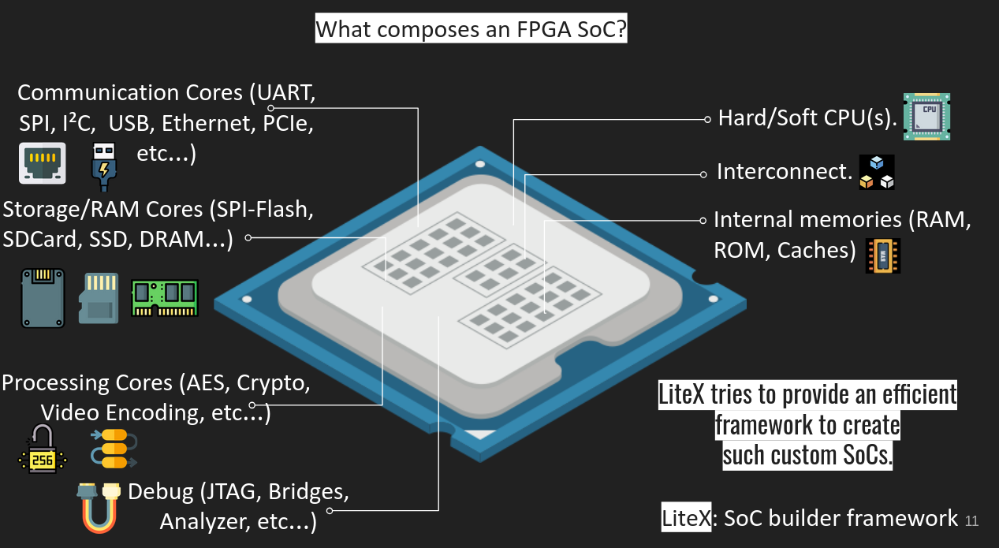
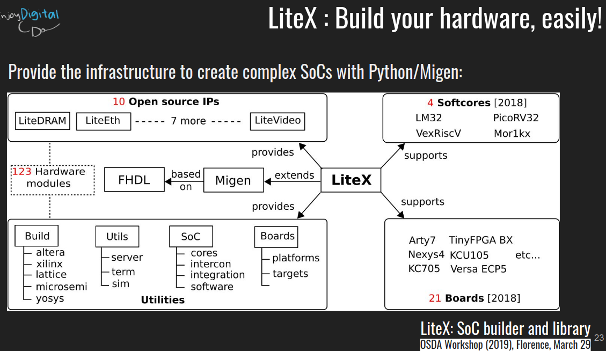

# 📘 Semana 1 - Investigación LiteX

## ¿Qué es LiteX?

LiteX es un **framework*️⃣ open-source en Python** para crear **SoCs*️⃣ sobre FPGAs** de forma modular.  
En vez de diseñar todo en Verilog/VHDL, ofrece bloques listos para conectar, simular y generar un sistema.

<small> 🔹 SoC: chip que integra CPU + memoria + periféricos.
🔹 Framework: como un kit de LEGO con piezas listas; en lugar de crear todo desde cero, solo armas con lo que ya viene.</small>

<p align="center">
  
</p>

## ⚙️ ¿Cómo funciona LiteX?

LiteX describe hardware usando Python + [Migen](https://m-labs.hk/misc/migen/) *️⃣ y lo convierte en HDL (Verilog/VHDL).  
Luego se sintetiza con herramientas open-source o propietarias, generando el *bitstream* para cargar en la FPGA o realiza la simulación con ayuda de [Verilator](https://www.veripool.org/verilator/) *️⃣  .

<small>🔹 Migen: librería de Python para describir circuitos digitales de forma más sencilla que en Verilog/VHDL.
🔹 Verilator: simulador rápido de diseños en Verilog, convierte el hardware en un modelo en C++ para probarlo sin FPGA.</small>

<p align="center">
  
</p>

## 🔄 Flujo de trabajo

```bash
Tu código Python (Migen/LiteX)
         ↓
Generación HDL (Verilog)
         ↓                                        ↓
Síntesis (Vivado/Quartus/nextpnr/Yosys) o Simulación en Verilator
         ↓
Bitstream para FPGA
```

## 🎯 ¿Para qué se usa?

- Crear SoCs rápidos y flexibles sobre FPGA.  
- Integrar periféricos complejos (PCIe, Ethernet, DRAM, SATA…).  
- Experimentar con CPUs RISC-V y correr sistemas operativos (ej. Linux).  
- Simular diseños completos sin hardware físico.  
- Reutilizar cores ya probados en lugar de empezar desde cero.

## 🧩 Arquitectura de LiteX

LiteX actúa como **pegamento** entre:

- Los **softcores** (CPUs implementadas en lógica programable).  
- Los **periféricos** (Ethernet, DRAM, SATA, PCIe, UART, etc.).  
- El **bus de interconexión** (Wishbone, AXI, Avalon-ST).  

Todo se define en Python, y LiteX se encarga de generar el RTL, la conexión entre bloques y el *CSR map* (registros de control).

<small>🔹 Softcore: procesador implementado en la FPGA por lógica programable, no grabado físicamente como un ARM Cortex en un SoC comercial.</small>

## 🖥️ Cores principales

LiteX tiene un ecosistema de módulos reutilizables llamados **LiteX cores**:

- **LiteDRAM:** controlador de memoria SDR/DDR/DDR3.  
- **LiteEth:** Ethernet hasta 1 Gbps.  
- **LitePCIe:** PCIe hasta Gen2 x4.  
- **LiteSATA:** almacenamiento SATA 1/2/3.  
- **LiteScope:** analizador lógico embebido.  
- **LiteSDCard, LiteSPI, LiteUSB, LiteVideo…**  

Esto evita que los estudiantes tengan que programar periféricos desde cero.

## 🧠 Softcores soportados

LiteX soporta varias CPUs “soft” que se implementan dentro de la FPGA:

- **VexRiscv (RISC-V):** flexible, rápido, ideal para correr Linux.  
- **PicoRV32 (RISC-V):** muy pequeño, perfecto para demos educativas.  
- **LM32 (Lattice Micro32):** legado, simple de entender.  
- **Rocket Chip (RISC-V):** núcleo de Berkeley, más avanzado.  
- **BlackParrot (RISC-V multicore).**

## ⚖️ Comparación con Vivado

- **Vivado (Xilinx):**
  - Entorno gráfico, intuitivo para principiantes.  
  - Fuerte dependencia de IPs propietarios.  
  - Menos flexible fuera del ecosistema Xilinx.  

- **LiteX:**
  - Basado en scripts Python → más flexible y portable.  
  - Ecosistema de IPs open-source (DRAM, Ethernet, PCIe, etc.).  
  - Curva de aprendizaje: requiere Linux/terminal.  

## 📝 Instalación de LiteX en Ubuntu

### 🔹 Paso 1: Crear directorio de trabajo

```bash
mkdir -p ~/Documents/litex
cd ~/Documents/litex
```

### 🔹 Paso 2: Instalar dependencias

```bash
sudo apt update
sudo apt install -y python3 python3-pip git meson ninja-build \
    libevent-dev libjson-c-dev verilator gtkwave
```

### 🔹 Paso 3: Descargar e instalar LiteX

> [!WARNING]  
> En Ubuntu 24.04 o superior puede aparecer el error  
> `externally-managed-environment`.  
> Solución rápida:  
>
> ```bash
> echo 'export PIP_BREAK_SYSTEM_PACKAGES=1' >> ~/.profile
> source ~/.profile
> ```

```bash
wget https://raw.githubusercontent.com/enjoy-digital/litex/master/litex_setup.py
chmod +x litex_setup.py
./litex_setup.py --init --install --user --config=standard
```

### 🔹 Paso 4: Verificar instalación

```bash
meson --version
ninja --version
python3 -c "import litex; print('LiteX instalado OK')"
```

### 🔹 Paso 5: Probar la simulación

```bash
litex_sim --cpu-type=vexriscv
```

## 📦 Implementaciones de SoCs en FPGA

### Digilent Basys3

### Terasic DE1-Standard
